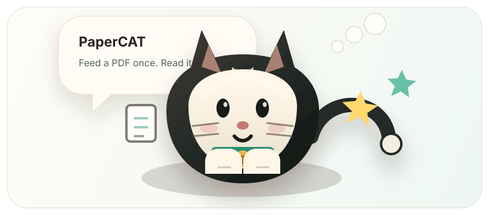

# PaperCAT

<p align="center">
  
</p>

PaperCAT 是一个桌面宠物式论文阅读助手。把 PDF 拖给小猫，它会自动缓存论文、解析正文、生成中文总结，并把原文、总结、标签、阅读状态和单篇论文 AI 对话都保存到本地历史记录里。

## 核心功能

- 桌面小猫投喂：拖拽 PDF 后用咀嚼、思考、完成、错误等状态反馈进度。
- 自动缓存：投喂时直接保存 PDF 到预设目录，不再弹出保存位置选择。
- 论文总结：基于 `skills/paper-cat-paper-reading/SKILL.md` 生成结构化中文 Markdown 总结。
- 历史阅读：历史页同步展示缓存 PDF 原文和 PaperCAT 总结，两个阅读窗口同高并可独立滚动。
- 论文管理：支持搜索、标签、阅读状态、时间标签和重复论文提醒。
- 单篇对话：每篇论文都有固定 AI 对话窗，会携带 PDF 正文片段和总结作为上下文，回复支持流式输出。
- 模型配置：内置常见 OpenAI-compatible 厂商和模型选项，用户主要填写 API key。

## 快速启动

当前阶段不需要先打包，直接把代码 clone 到本地后启动即可。

准备环境：

- Windows
- Git
- Python 3.10+
- Node.js 18+

克隆并进入项目：

```powershell
git clone https://github.com/Star-Learning/PaperCAT.git
cd PaperCAT
```

首次启动：

```bat
start_papercat.cmd
```

这个脚本会自动创建 Python 虚拟环境、安装前后端依赖、启动 FastAPI 后端，并打开 Electron 桌面小猫。

已经安装过依赖时，可以跳过依赖安装：

```powershell
powershell.exe -NoProfile -ExecutionPolicy Bypass -File scripts\start_papercat.ps1 -SkipInstall
```

后端健康检查：

```powershell
Invoke-RestMethod -Uri http://127.0.0.1:8766/api/health
```

看到 `status: ok` 就说明后端已经启动。

## 配置流程

第一次打开时，如果暂时不想配置保存路径或大模型 API，可以先跳过。之后随时可以从小猫菜单打开“设置”。

保存路径配置：

1. 打开小猫菜单里的“设置”。
2. 在保存路径区域选择或填写论文缓存目录。
3. 保存后，之后投喂的 PDF 会自动复制到这个目录，不会再弹出保存文件选择框。

如果没有手动配置，默认使用：

```text
backend/outputs/cache/
```

大模型 API 配置：

1. 打开小猫菜单里的“设置”。
2. 选择大模型厂商，例如 OpenAI、DeepSeek、DashScope、Kimi、智谱、SiliconFlow 或 OpenRouter。
3. 选择模型。
4. 粘贴对应厂商的 API key。
5. 保存配置。

一般不需要手动填写 Base URL，PaperCAT 会根据厂商选项自动配置 OpenAI-compatible 接口地址。

本地配置和密钥文件：

```text
backend/secrets/llm.env
backend/secrets/storage.env
```

这些文件不会提交到 Git。

## 本地数据

默认数据位置：

```text
backend/data/papers.db
backend/outputs/cache/
```

缓存目录中会保存 PDF 副本、`metadata.json` 和 `summary.md`。历史记录、标签、阅读状态和论文对话会写入 SQLite。

## 项目结构

```text
backend/    FastAPI 后端、PDF 解析、LLM 调用、SQLite 存储
desktop/    Electron + React 桌面端、小猫 UI、历史记录和论文对话
scripts/    启动脚本
skills/     PaperCAT 论文总结 skill
```

## 开发检查

```powershell
cd desktop
npm run build
```

```powershell
cd backend
.\.venv\Scripts\python.exe -m compileall app
```

```powershell
cd desktop
node --check electron\main.cjs
node --check electron\preload.cjs
```

## 可能待完善

- 扫描版 PDF 的 OCR 支持。
- 批量投喂和批量整理论文。
- Zotero、BibTeX 或文献库同步。
- 更细的阅读位置记忆、批注和高亮。
- 本地模型模式和模型连通性测试。
- 更多总结模板，例如复现指南、审稿视角、领域综述卡片。
